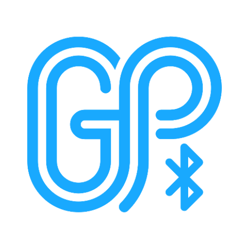

  
  <h1>即刻贴 (GeekPaste)</h1>

---

## 项目简介

基于低功耗蓝牙(BLE)的跨平台剪贴板同步软件。实现类似iPhone与mac的丝滑同步体验。

Android作为中心设备，macOS、Windows作为边缘设备。

软件本身也是Xposed模块，用于实现 Android 10+ 后台读取剪贴板功能，Hook 位置：[Hook.kt](./app/src/main/java/com/h3110w0r1d/geekpaste/Hook.kt)

推荐[不死鸟保活模块](https://github.com/h3110w0r1d-y/Phoenix)，搭配食用口感更佳！

## 下载应用

  - Android/macOS: [Latest Release](https://github.com/h3110w0r1d-y/GeekPaste/releases/latest)
  - Windows: ~~(新建文件夹)~~

## 画饼

  - [x] Android <-> macOS 剪贴板互相同步
  - [ ] Windows 客户端

如有建议或问题欢迎提交 Issue 反馈。
